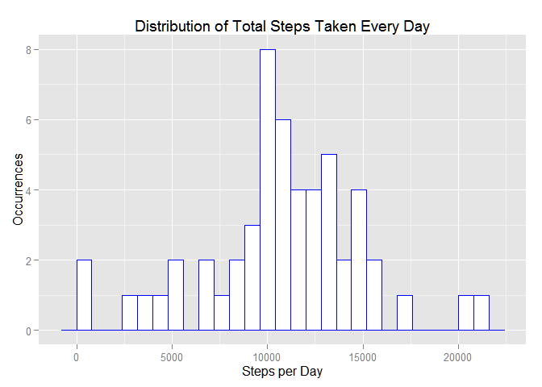
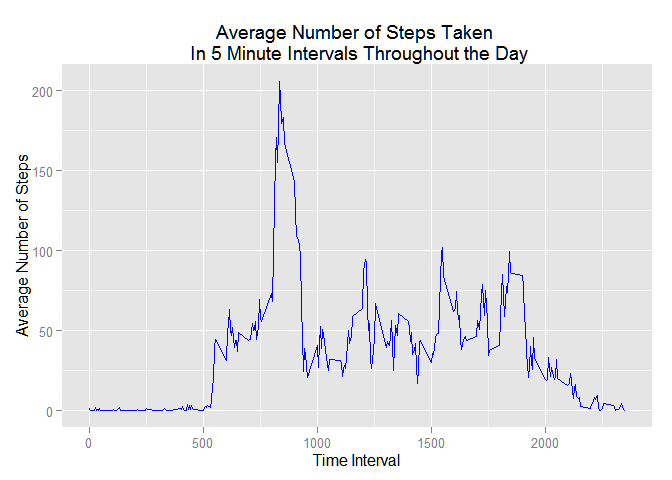
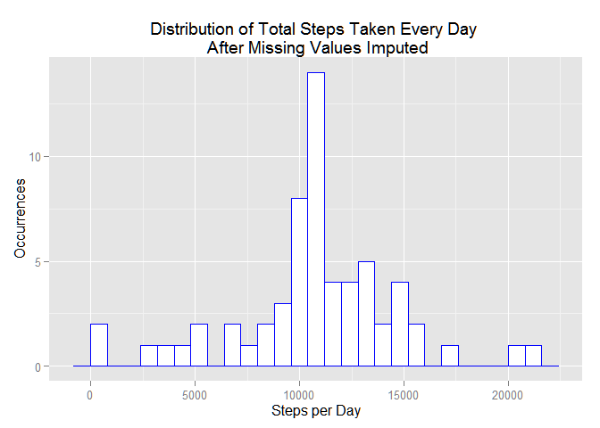
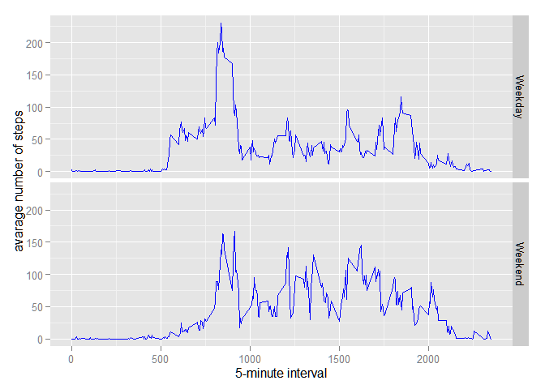

# Reproducible Research: Peer Assessment 1


# Loading and preprocessing the data

Read the data file, unzip it, and change the date to date format.


```r
setwd("D:/Document/RProgramming/RepData_PeerAssessment1")

unzip("activity.zip")

activity <- read.csv("activity.csv", header=TRUE)

activity$date <- as.Date(activity$date, format = "%Y-%m-%d")
```

# What is mean total number of steps taken per day?

Calculate total steps per day and plot a histogram of the distribution. Then post the mean and median.


```r
SumDays <- aggregate(activity$steps, by = list(activity$date), FUN = "sum")

colnames(SumDays) <- c("Day", "Total_Steps")

library(ggplot2)
ggplot(SumDays, aes(x = Total_Steps)) + 
    geom_histogram(binwidth = 800, fill="white", color="blue") + 
    labs(title="Distribution of Total Steps Taken Every Day", x = "Steps per Day", y="Occurrences")
```

 

```r
MeanSteps <- mean(SumDays$Total_Steps, na.rm=TRUE)

MedianSteps <- median(SumDays$Total_Steps, na.rm=TRUE)
```

The Mean Daily Number of Steps is 1.0766189\times 10^{4}

The Median Daily Number of Steps is 10765

# What is the average daily activity pattern?

Calculate the mean for each 5 minute period, then plot.  Find the period with the maximum average steps and post it.


```r
activity2 <- activity[!is.na(activity$steps), ]

Intervals <- aggregate(activity2$steps, by = list(activity2$interval), FUN = "mean")

colnames(Intervals) <- c("Time_Interval", "Mean_Steps")

g <- ggplot(Intervals, aes(x = Time_Interval, y = Mean_Steps))
g + geom_line(binwidth = 800, fill="white", color="blue") + 
    labs(title="Average Number of Steps Taken \n In 5 Minute Intervals Throughout the Day", 
         x = "Time Interval", y = "Average Number of Steps")
```

 

```r
HighInterval <- Intervals[which.max(Intervals[, 2]), 1]
HighValue <- Intervals[which.max(Intervals[, 2]), 2]
```

The Maximum Average Number of Steps in a 5 minute interval is 206.1698113 and this starts at 835 minutes into the day.

# Imputing missing values

Find the total missing vales and report.

Strategy for NAs: Fill in the NA values with the mean for that interval, plot the histogram to see how it changes.  

Post the mean and median after missing values are imputed.


```r
missing <- (nrow(activity)- sum(complete.cases(activity)))
```

There are 2304 rows with missing values


```r
activity3 <- merge(activity, Intervals, by.x = "interval", by.y = "Time_Interval", all.x = TRUE)
activity3$steps[is.na(activity3$steps)] <- activity3$Mean_Steps[is.na(activity3$steps)]
                 
SumDays3 <- aggregate(activity3$steps, by = list(activity3$date), FUN = "sum")

colnames(SumDays3) <- c("Day", "Total_Steps")

library(ggplot2)
ggplot(SumDays3, aes(x = Total_Steps)) + geom_histogram(binwidth = 800, fill="white", color="blue") + 
    labs(title="Distribution of Total Steps Taken Every Day \n After Missing Values Imputed", x = "Steps per Day", y="Occurrences")
```

 

```r
MeanSteps3 <- mean(SumDays3$Total_Steps)

MedianSteps3 <- median(SumDays3$Total_Steps)
```

Once the means for the interval replace missing values are imputed:

The Mean Daily Number of Steps is 1.0766189\times 10^{4}

The Median Daily Number of Steps is 1.0766189\times 10^{4}

The Mean stayed the same, the Median adjusted to the Mean.

# Are there differences in activity patterns between weekdays and weekends?

Identify which days are weekdays and weekends, then post the data for each set of days to see if there is a difference in patterns.


```r
activity3$Weekday <- ifelse(weekdays(activity3$date) != "Saturday" & 
                                weekdays(activity3$date) != "Sunday", "Weekday", "Weekend")

activity3$Weekday <- as.factor(activity3$Weekday)

Intervals4 <- aggregate(activity3$steps, by = list(activity3$Weekday, activity3$interval), FUN = "mean")

colnames(Intervals4) <- c("Weekday", "Interval", "Mean_Steps")

ggplot(Intervals4, aes(Interval, Mean_Steps)) + 
    geom_line(binwidth = 800, fill="white", color="blue") + 
    facet_grid(Weekday ~ .) +
    xlab("5-minute interval") + 
    ylab("avarage number of steps")
```

 
